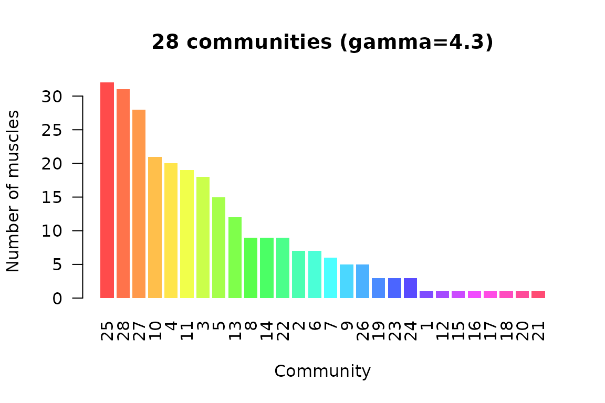

# Getting started with PhysioMSKNet

PhysioMSKNet treats the musculoskeletal system as a **hypergraph**:
bones are vertices and muscles are hyperedges connecting the bones they
attach to (Murphy et al. 2018). This vignette walks through the core
workflow — build a hypergraph, measure it, detect communities, score
perturbation impact, and compare impact against a degree-preserving null
model — using a small synthetic network first and then the bundled
dataset. Everything here runs offline.

## A hypergraph from an incidence matrix

The incidence matrix `C` has one row per bone and one column per muscle,
with `C[i, j] = 1` when muscle *j* attaches to bone *i*. Here is a tiny
four-bone, four-muscle ring:

``` r

C <- matrix(c(1, 1, 0, 0,   0, 1, 1, 0,   0, 0, 1, 1,   1, 0, 0, 1),
            nrow = 4, dimnames = list(paste0("bone", 1:4), paste0("m", 1:4)))
hg <- MSKHypergraph(C)
hg
#> MSKHypergraph
#>   Bones (vertices): 4 
#>   Muscles (hyperedges): 4 
#>   Connections: 8 
#>   Sparsity: 0.5 
#>   Muscle degree range: 2-2 
#>   Bone degree range: 2-2
```

The degree of a muscle (hyperedge) is the number of bones it spans; the
degree of a bone (vertex) is the number of muscles attached to it:

``` r

hyperedgeDegree(hg)
#> m1 m2 m3 m4 
#>  2  2  2  2
vertexDegree(hg)
#> bone1 bone2 bone3 bone4 
#>     2     2     2     2
```

## Projections and network metrics

Collapsing the hypergraph onto the bones gives a weighted bone–bone
graph; the network metrics are computed on that projection.

``` r

as.matrix(projectBoneGraph(hg))
#>       bone1 bone2 bone3 bone4
#> bone1     0     1     0     1
#> bone2     1     0     1     0
#> bone3     0     1     0     1
#> bone4     1     0     1     0
m <- mskNetworkMetrics(hg, type = "bone")
m$density
#> [1] 0.6666667
m$degree
#> bone1 bone2 bone3 bone4 
#>     2     2     2     2
```

## Community detection

[`mskCommunityDetect()`](https://x-biosignal.github.io/PhysioMSKNet/reference/mskCommunityDetect.md)
runs Louvain modularity with a resolution parameter `gamma`. On the
bundled network the paper’s resolution (`gamma = 4.3`) yields the
functional muscle communities:

``` r

hg_full <- MSKHypergraph()
comm <- mskCommunityDetect(hg_full, gamma = 4.3)
comm$n_communities
#> [1] 28
plotCommunityStructure(comm)
```



## Perturbation impact

The impact score perturbs one muscle in a damped harmonic-oscillator
model and sums the resulting displacement across all bones.
[`mskSimulate()`](https://x-biosignal.github.io/PhysioMSKNet/reference/mskSimulate.md)
sets the model up; a short run is enough for the synthetic network:

``` r

sim <- mskSimulate(hg, n_steps = 100)
scores <- mskImpactScoreAll(sim, verbose = FALSE)
scores
#>  m1  m2  m3  m4 
#> 200 200 200 200
```

## Comparison against a null model

To tell a structurally important muscle from one that merely has a high
degree, compare its impact against a degree-preserving null ensemble.
The deviation is expressed in standard deviations of the null
distribution:

``` r

ens <- mskNullEnsemble(hg, n_null = 20, sim_params = list(n_steps = 100),
                       verbose = FALSE)
mskImpactDeviation(scores, hg, ens$null_scores)
#>        m1        m2        m3        m4 
#> 0.8094272 0.6164414 0.6807456 0.5247498
```

## Reproducing the paper’s statistics

The bundled validation tables let you reproduce the headline
relationships without re-running the full simulation. For example, the
impact-deviation / clinical-recovery regression (Fig. 3b):

``` r

rec <- mskImpactRecoveryModel()
rec$r_squared
#> [1] 0.4086942
rec$paper_target$r_squared
#> [1] 0.757
```

## Where to go next

- Bridge the network to measured signals with
  [`emgToMSKMapping()`](https://x-biosignal.github.io/PhysioMSKNet/reference/emgToMSKMapping.md),
  [`imuToMSKMapping()`](https://x-biosignal.github.io/PhysioMSKNet/reference/imuToMSKMapping.md)
  and
  [`mocapToMSKMapping()`](https://x-biosignal.github.io/PhysioMSKNet/reference/mocapToMSKMapping.md),
  then the matched analyses
  ([`imuNetworkKinematics()`](https://x-biosignal.github.io/PhysioMSKNet/reference/imuNetworkKinematics.md),
  [`imuImpactPrediction()`](https://x-biosignal.github.io/PhysioMSKNet/reference/imuImpactPrediction.md),
  …).
- The EMG-driven Hill muscle model
  ([`emgDrivenForce()`](https://x-biosignal.github.io/PhysioMSKNet/reference/emgDrivenForce.md),
  [`calibrateEMGDrivenModel()`](https://x-biosignal.github.io/PhysioMSKNet/reference/calibrateEMGDrivenModel.md))
  turns an EMG envelope into muscle force and joint moment.
- See
  [`?PhysioMSKNet`](https://x-biosignal.github.io/PhysioMSKNet/reference/PhysioMSKNet-package.md)
  for the full, task-grouped index of entry points.

## Reference

Murphy AC, Muldoon SF, Baker D, Lastowka A, Bennett B, Yang M, Bhatt P,
Bassett DS (2018). “Structure, function, and control of the human
musculoskeletal network.” *PLOS Biology* 16(1): e2002811.
